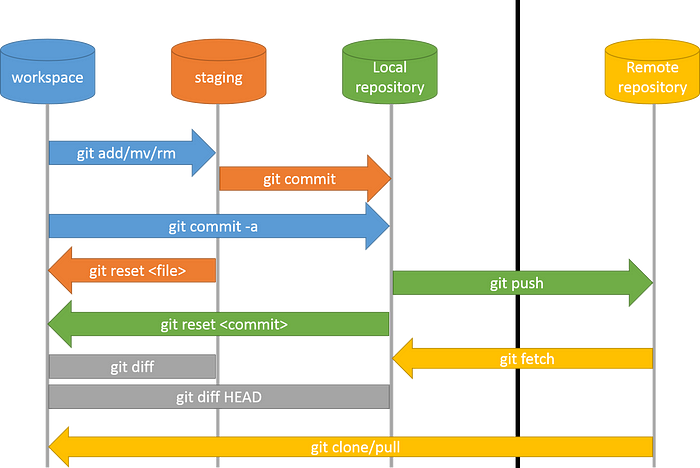

### notes on branches and PR

When working on a project, especially as a team, you want to work on features independently, so they never affect anyone else's work. Git offers us branches to keep our current work away from a teams common codebase until completion.

A branch lets you split from the main line of development. The new branch shares a part of its commit history with the main branch. At a certain commit the new branch branches off and the commit histories differ.

### lists of commands

- git branch -m 
- git checkout branch
- git pull request
- git merge
- git push origin(local) nombre.branch.destino
- git switch nombre.branch
- git switch -c nombre.branch
- git pull
- git fetch
- git branch -d nombre.branch

### Git Local - Remote Schema

